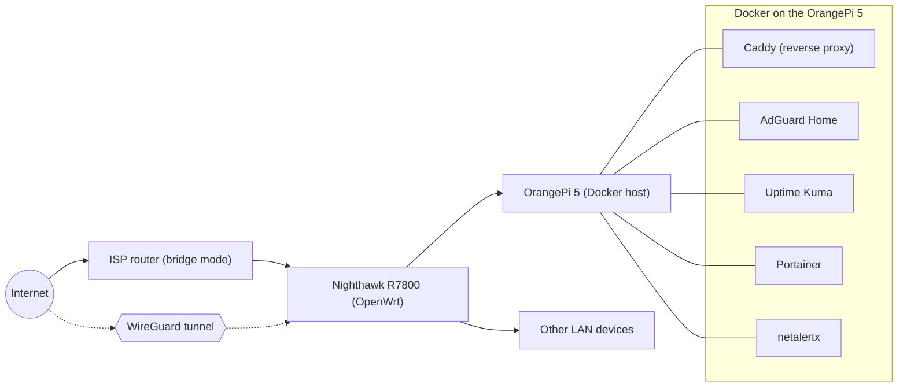

## The router

I had a Netgear Nighthawk X4S R7800 left over from before I moved and switched ISPs. The new place came with an ISP all-in-one unit, so the Nighthawk sat unused in a drawer for a while, still perfectly capable hardware doing nothing.

I pulled it back out, updated it to the latest stock firmware, then flashed OpenWrt on top of it. On this router that meant selecting the custom firmware image directly from the stock admin panel's update screen, no serial cable or recovery mode required. OpenWrt is a Linux-based firmware for routers and similar embedded devices. It replaces the vendor firmware entirely, which trades some of the polish of a stock GUI for real package management, proper firewall rules, and native VPN support instead of whatever subset the vendor decided to expose.

Once OpenWrt was running, I put the ISP router into bridge mode so it just passes a public IP through instead of trying to route anything itself, and let the Nighthawk take over as the actual gateway. That's the arrangement I'm still running.



## Why an OrangePi 5

I'd run a lighter setup before, Pi-hole and a couple of small services on an older Raspberry Pi, but that stopped getting maintained through the move and sat idle. When I picked the project back up in early 2023, I went with an OrangePi 5 instead of replacing it with another Raspberry Pi.

The comparison at the time was mostly against the Raspberry Pi 4, which was still the mainstream option before the Pi 5 shipped later that year. The Pi 4 tops out at 8GB of RAM, a quad-core Cortex-A72 at 1.5GHz, and no PCIe lane for local NVMe storage. The OrangePi 5 uses a Rockchip RK3588S, a system-on-chip, meaning the CPU cores, GPU, and a dedicated AI accelerator all sit on the same die rather than being separate components. It's an eight-core big.LITTLE layout: four Cortex-A76 cores up to 2.4GHz for heavier work, four Cortex-A55 cores up to 1.8GHz for everything else, plus a Mali-G610 GPU and a 6 TOPS NPU I have no current use for. RAM options went up to 32GB; I picked 16GB, which was still a meaningful amount to get on a board that size at the time. It also has an M.2 slot for NVMe storage instead of relying on a microSD card, which mattered more to me in practice than the extra cores did.

I wanted to actually use the extra headroom for Docker and Linux work rather than keep running the same light Pi-hole setup, and the spec gap made the OrangePi 5 the obvious pick over sticking with the Pi ecosystem.

## Getting it running

Before touching software, I put the board in a case with an active GPIO-powered fan and heatsink rather than running it open-board, and moved the boot drive onto a 128GB NVMe SSD in the M.2 slot instead of booting from a microSD card.

```bash
lsblk
NAME        SIZE TYPE MOUNTPOINT
mmcblk0     29.7G disk
nvme0n1    119.2G disk
├─nvme0n1p1  256M part /boot
└─nvme0n1p2  118.9G part /
```

From there it was the usual round of `apt` housekeeping, then zsh with Oh My Zsh and Powerlevel10k, the same shell setup I run on my other Linux boxes so a new terminal doesn't feel like a different machine.

```bash
sh -c "$(curl -fsSL https://raw.githubusercontent.com/ohmyzsh/ohmyzsh/master/tools/install.sh)"
```

## The Docker stack

Portainer went in first, right after Docker itself, mostly so I wasn't managing everything through raw `docker` commands indefinitely. Caddy came next as a reverse proxy once I had more than a couple of services running and wanted clean addresses instead of remembering a different port for each one. AdGuard Home followed, both for network-wide ad blocking and to give the rest of the stack a local DNS resolver. Uptime Kuma came later, once there was enough running to actually be worth watching, and netalertx alongside it once "what's actually on my network" became a question worth automating instead of checking by hand.

```bash
docker ps --format "table {{.Names}}\t{{.Image}}\t{{.Status}}"
NAMES          IMAGE                                STATUS
caddy          caddy:latest                         Up 3 days
adguardhome    adguard/adguardhome:latest            Up 3 days
uptime-kuma    louislam/uptime-kuma:latest           Up 3 days (healthy)
portainer      portainer/portainer-ce:latest         Up 3 days
netalertx      ghcr.io/netalertx/netalertx:latest    Up 3 days (healthy)
```

I also run a WebGoat container for hands-on practice, intentionally vulnerable and kept off the LAN-facing side of things, stopped between uses rather than left running. And I spin up short-lived containers for one-off things, a Minecraft server for LAN play being the recurring example, that never become part of the permanent stack.

## DNS and internal certificates

AdGuard Home already sits in the DNS path for the whole LAN, so I pointed its upstream resolver at Quad9 over DNS-over-HTTPS instead of leaving it on the ISP's default resolver or a plain unencrypted upstream. That keeps DNS queries encrypted in transit between the OrangePi5 and Quad9, and Quad9 filters known-malicious domains on top of whatever AdGuard is already blocking locally, so filtering happens at two layers instead of one.

```text
# AdGuard Home upstream DNS servers
https://dns.quad9.net/dns-query
```

For internal service names, I set up Caddy's built-in internal CA instead of relying on self-signed certificates or plain HTTP for anything that never leaves the LAN. Caddy can act as its own local certificate authority and issue certs automatically for internal hostnames. Importing that CA's root certificate onto my devices means services resolve over HTTPS with a name I chose instead of an IP address and a browser warning, and the certificate is actually trusted rather than clicked through every time.

```text
# Caddyfile
status.home.arpa {
    tls internal
    reverse_proxy localhost:3001
}
```

`home.arpa` is the domain RFC 8375 reserves specifically for naming things on home networks, which is a cleaner choice than making up a TLD that might collide with something real later.

## Network monitoring

On the router I installed nlbwmon for per-device bandwidth monitoring, since I wanted actual usage broken down by device rather than a single monthly total from the ISP. It also helps find bandwidth hogs easily.

For anything deeper I capture on the router and analyze elsewhere. Running `tcpdump` locally on OpenWrt works, but doing real analysis on the router itself doesn't. Instead I pipe the capture over SSH into Wireshark or `tshark` running on whichever machine I'm actually working from:

```bash
ssh router tcpdump -i eth1 -w - | wireshark -k -i -
```

The router does the capturing, the dissecting happens wherever I am.

## Two WireGuard profiles

I keep more than one WireGuard client profile and switch between them depending on what I'm doing. A full-tunnel profile routes all of a device's traffic home, which is what I use on networks I don't trust: it picks up ad blocking through AdGuard Home for the whole device and makes the device look like it's on my home network for anything that cares. A split-tunnel profile only routes traffic destined for my home subnet through the tunnel and lets everything else use the local connection directly, which I use when I just need to reach something specific back home, like a container or a file, without paying my home upload speed as a bottleneck for whatever else I'm doing at the same time. I'm also able to use my own quad9 encrypted DNS while connected to my VPN.

```ini
# full tunnel
[Peer]
AllowedIPs = 0.0.0.0/0

# split tunnel
[Peer]
AllowedIPs = 10.x.x.0/24
```

## What's next

Two things I'm planning to add. An RTL-SDR on the server, extending the same remote-capture pattern I already use for network traffic to RF and analog signals: streaming SDR capture data out to a remote session the same way `tcpdump` output gets piped to a local Wireshark now. And reviving an old external backup HDD I still have to run Nextcloud, host a couple of git repos, and keep a remote Obsidian vault, consolidating a few things that are currently scattered elsewhere onto hardware that's otherwise sitting idle.

