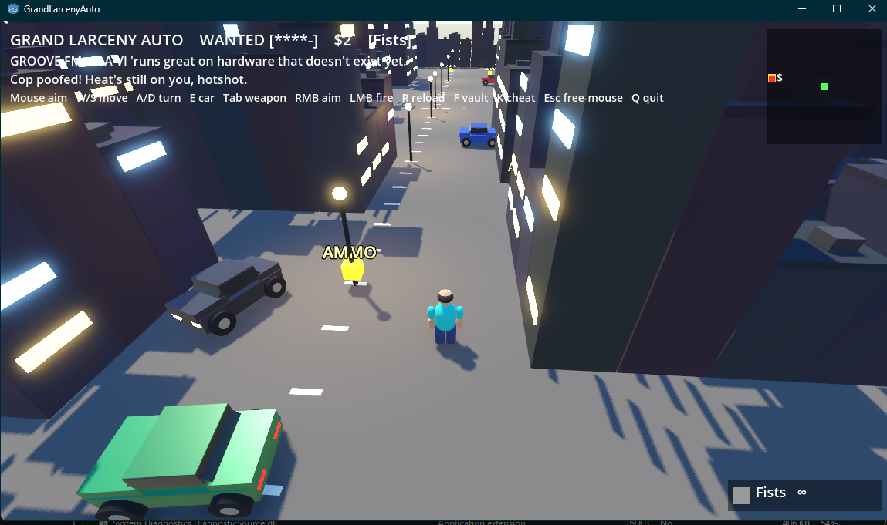
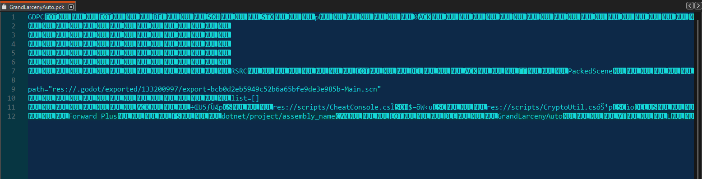
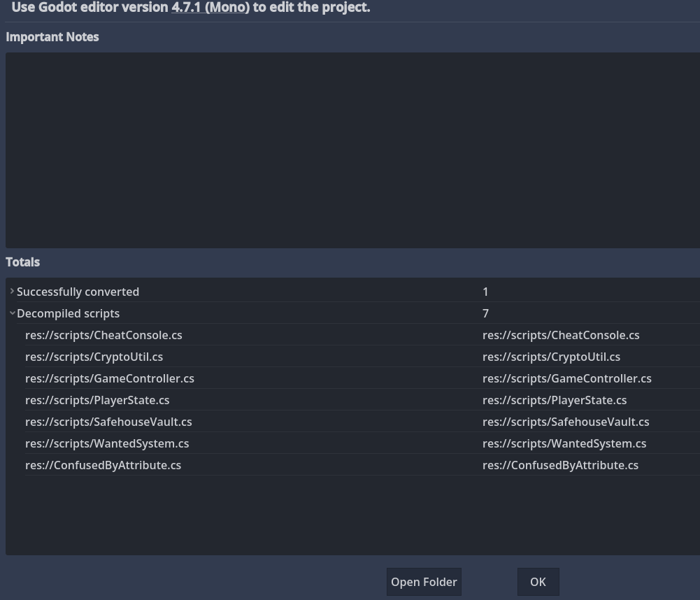
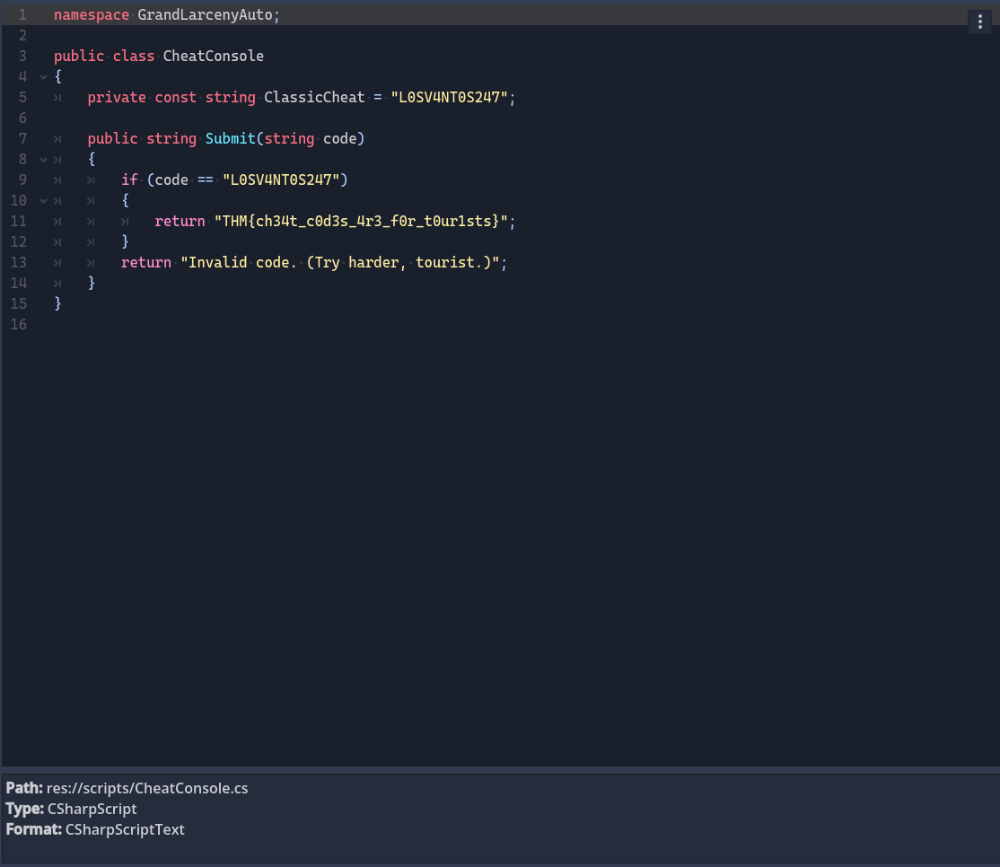
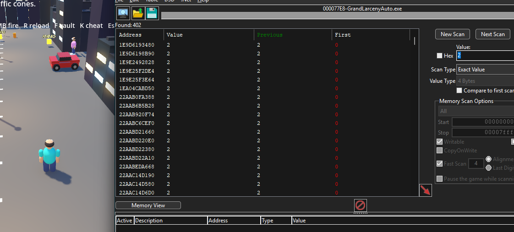
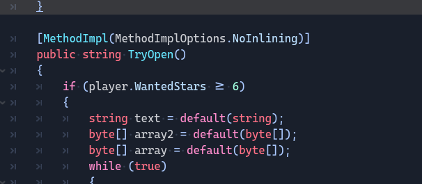
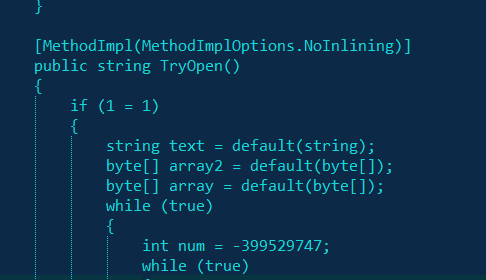
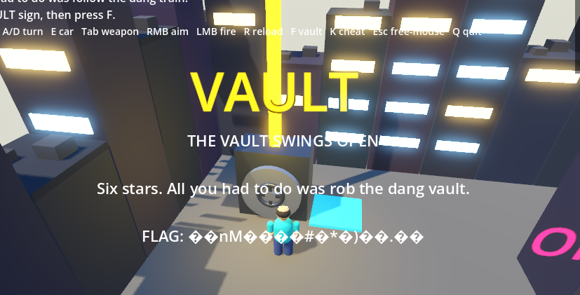
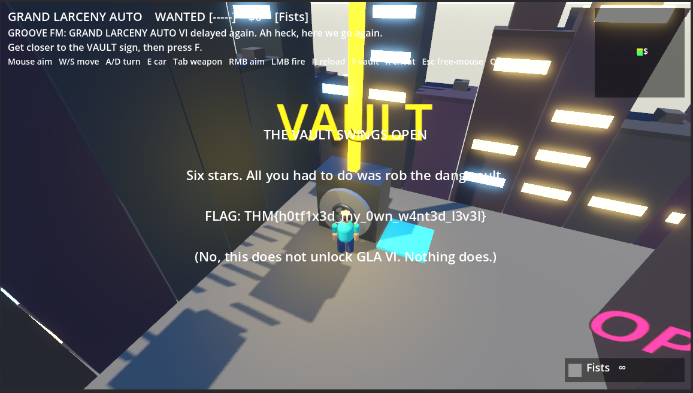

## Context

<a href="https://tryhackme.com/room/grandlarcenyauto" target="_blank" rel="noopener noreferrer">Grand Larceny Auto</a> was built around a deliberately impossible objective: cause enough chaos to reach six wanted stars, then open the vault.

Unlike most of the TryHackMe rooms I had completed, this one gave me a downloadable game instead of a target machine. It was made with <a href="https://godotengine.org/" target="_blank" rel="noopener noreferrer">Godot</a>, a free and open-source engine for building 2D and 3D games. Godot itself is cross-platform, but the challenge file was only supplied as a Windows build. That moved most of this session onto my host, and recovering the C# project later led me to download the matching Godot `4.7.1` .NET editor for Windows.

I began by treating it like a game rather than immediately pulling it apart. I fought the NPCs, drove the cars, followed the points of interest, and kept returning to the vault to see whether I had missed an interaction. The game was charmingly glitchy, but none of that got me very far. I made a total of `$2`, reached four visible wanted stars during one run, and could not find a normal action that opened the vault.



At that point the room felt less like a hidden-input puzzle and more like a reverse-engineering task.

## Opening the game package

I downloaded the room archive in Kali, checked its metadata, and extracted it before moving the complete directory into the shared lab artifacts:

```bash title="Kali"
exiftool GrandLarcenyAuto-windows-1784400165101.zip
unzip GrandLarcenyAuto-windows-1784400165101.zip
```

The Windows build contained the executable, a data directory, and a small `GrandLarcenyAuto.pck` file. Opening the PCK as text mostly produced binary noise, although a few strings were readable. Paths such as `res://scripts/CheatConsole.cs` and `res://scripts/CryptoUtil.cs` confirmed that the package still described the project's C# scripts.



After some searching, I found <a href="https://github.com/GDRETools" target="_blank" rel="noopener noreferrer">GDRE Tools</a>, a collection of Godot reverse-engineering utilities, and used it to recover the project. It identified the package as Godot `4.7.1` and decompiled seven C# scripts, including `CheatConsole.cs`, `SafehouseVault.cs`, `WantedSystem.cs`, and `CryptoUtil.cs`.



That was the turning point. Even with obfuscated control flow in a few methods, the class names and important values were clear enough to follow the challenge's logic.

## The first flag was bait

`CheatConsole.cs` immediately exposed a classic-looking cheat code and something formatted like a flag:

```csharp title="CheatConsole.cs"
private const string ClassicCheat = "L0SV4NT0S247";

public string Submit(string code)
{
    if (code == "L0SV4NT0S247")
    {
        return "THM{ch34t_c0d3s_4r3_f0r_t0ur1sts}";
    }

    return "Invalid code. (Try harder, tourist.)";
}
```



I entered `L0SV4NT0S247` through the in-game cheat prompt, but nothing triggered beyond the same flag-shaped string from the source appearing in the game. I entered that result on the TryHackMe room page too, and it was not accepted there either. Odd... but the surrounding code explained why: submitting a cheat only copied the returned string into the game's message label. It never changed the player's wanted level or vault state.

## Alright, I'll try live memory editing

The room hint said that the game logic could be patched or its memory modified. Before rebuilding the recovered project, I tried the live-memory route with <a href="https://www.cheatengine.org/" target="_blank" rel="noopener noreferrer">Cheat Engine</a>.

I began with an exact-value scan at `0`, changed the in-game cash value, and narrowed the results using the new values. The first scan returned far too many candidates, and the later scans still did not isolate a useful address with the settings I was using.



That attempt did not produce a stable value to edit. Since the source was already available, continuing to guess at memory representations felt less useful than following the actual wanted and vault classes.

## Following the impossible sixth star

`WantedSystem.cs` revealed the contradiction built into the room. Heat could increase, but the escalation path clamped the result to five:

```csharp title="WantedSystem.cs"
private const int MaxStars = 5;

public void EscalateHeat(int amount)
{
    int num = player.WantedStars + amount;

    if (num > 5)
    {
        num = 5;
    }

    player.WantedStars = num;
}
```

The vault expected a value the normal game could never produce:

```csharp title="SafehouseVault.cs (original)"
if (player.WantedStars >= 6)
{
    // Decrypt the sealed vault data.
}
```



The same method also passed the current wanted level into `CryptoUtil.DeriveKey`. `CryptoUtil` combined that number with the string `GLA::vault::key::v1::stars=`, hashed the result with SHA-256, and used the derived bytes to XOR the sealed vault data. Six stars were therefore doing two jobs: authorizing the vault and supplying part of its decryption key.

## Forcing the branch was only half the patch

My first source edit replaced the six-star condition with an always-true comparison:

```csharp title="SafehouseVault.cs (first patch)"
if (1 == 1)
{
    // Existing vault logic continues here.
}
```



This did make the vault branch run, but the output was unreadable.



The screenshot helped fill in what had happened. The patch had not skipped decryption; it had allowed decryption to run with the wrong input. Deeper in the same method, the original call was still:

```csharp title="SafehouseVault.cs (original key input)"
array = CryptoUtil.DeriveKey(player.WantedStars);
```

The player had no wanted stars when I tested the patched build, so the method derived the key for `0` rather than `6`. The vault method still returned a string beginning with `VAULT UNSEALED`, which was enough for `GameController` to show the win screen, but the decrypted portion was nonsense.

## Supplying the value the cipher expected

Instead of trying to make the rest of the game genuinely hold six stars, I changed the key-derivation argument to the value the sealed data expected:

```csharp title="SafehouseVault.cs (final patch)"
if (1 == 1)
{
    // ...
    array = CryptoUtil.DeriveKey(6);
    // ...
}
```

This preserved the original decryption sequence while emulating a six-star state at the point where it mattered. The recovered project saved in the artifacts confirms both parts of the final patch: the reachable vault branch and the constant `6` passed into `DeriveKey`. `WantedSystem.cs` remained capped at five.

Running the rebuilt project and interacting with the vault now produced the real flag:

```text title="flag"
THM{h0tf1x3d_my_0wn_w4nt3d_l3v3l}
```



What made this room fun was that the obvious bypass really did change the program's behavior, just not enough to solve it. The failed output was a useful clue: the star count was not only a gate but also data flowing into the cipher.

This ended up being one of my favorite CTF rooms so far. I enjoyed the detours it made me take, from playing the game, to unpacking Godot resources, to briefly poking at live memory. I especially liked how the final step made me track the control flow instead of stopping at the first condition that looked wrong. The culprit behind the encrypted flag was not one impossible comparison by itself, but the same impossible value quietly reappearing as part of the decryption key.

## Takeaways

- Recovering the Godot project was more productive than continuing to narrow an uncertain in-memory value.
- Making a condition true did not satisfy the downstream dependency on `player.WantedStars`; the same value also selected the decryption key.
- Even with obfuscated decompiler output, the boundaries between `WantedSystem`, `SafehouseVault`, and `CryptoUtil` made the intended contradiction readable.
