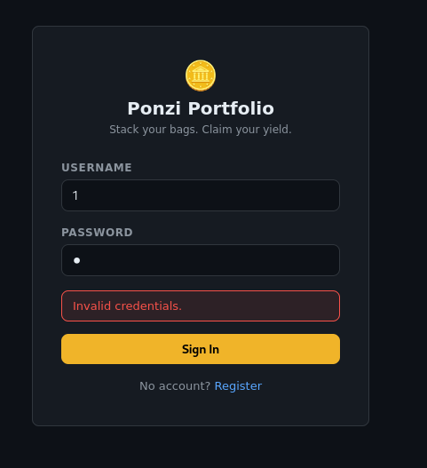
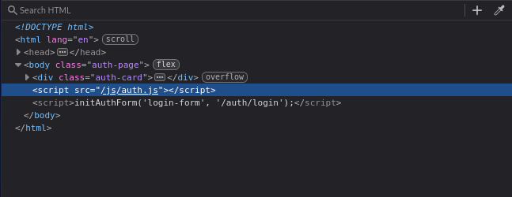
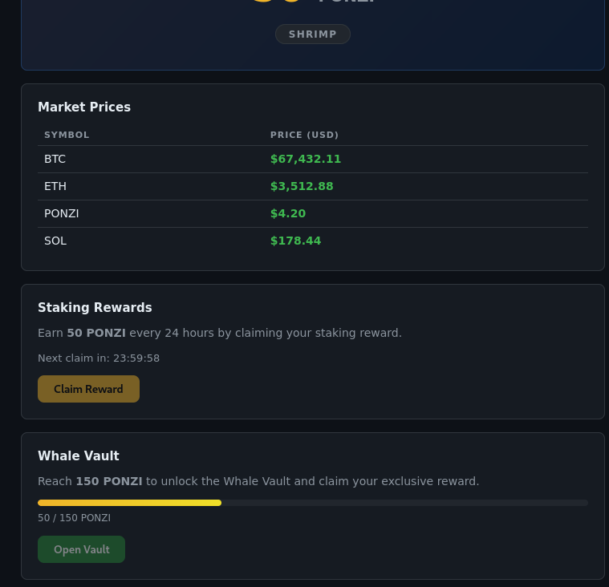
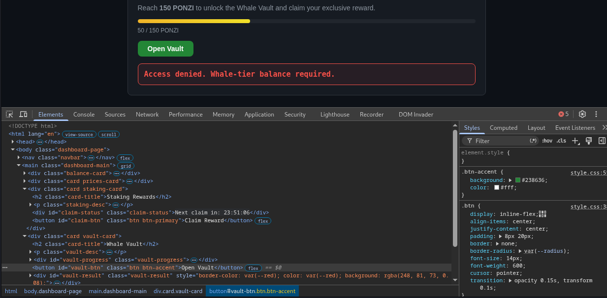
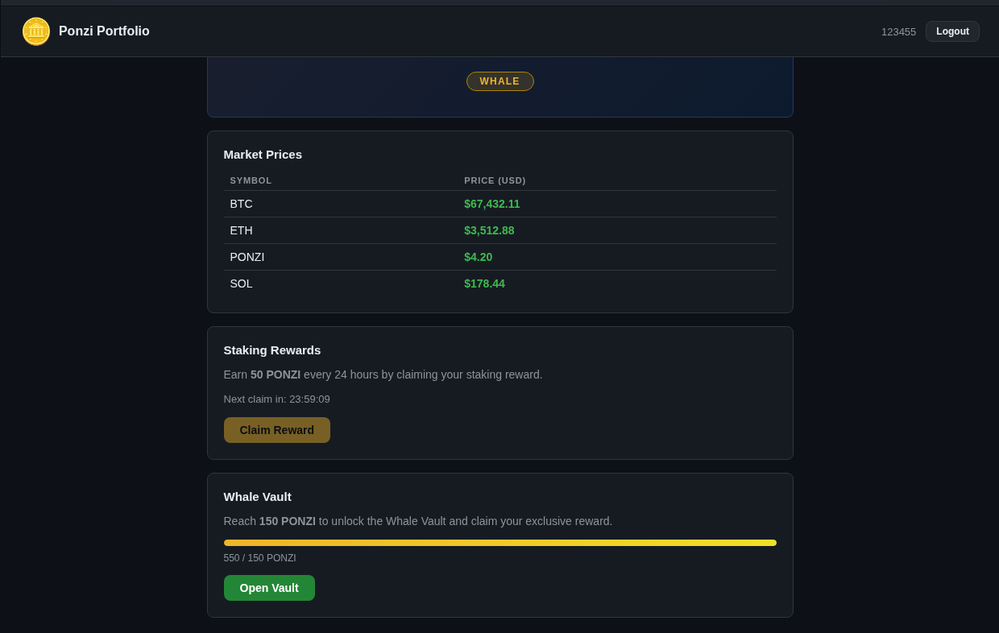
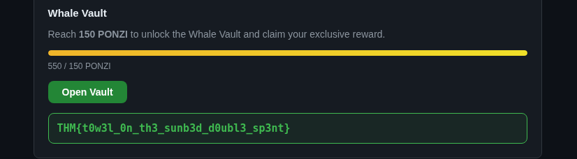
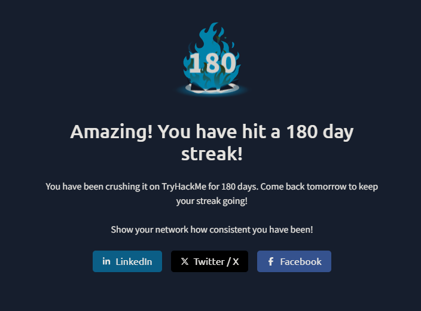

## Context

[Towel on the Sunbed](https://tryhackme.com/room/hh-towelonthesunbed-61271709) presented me with a small investment-themed web application called **Ponzi Portfolio**. The application allowed users to register, claim a periodic staking reward, and open a Whale Vault after reaching a balance of 150 PONZI.

I did not know at the start whether the challenge would be about authentication, client-side controls, or the way the balance was calculated. My aim was to follow those possibilities in roughly the order they appeared and keep the failed ideas that changed my understanding.

## Starting with the login page

I connected the Kali VM to the TryHackMe network and ran basic service enumeration:

```bash
sudo nmap -sV <TARGET_IP>
```

The web application was available on port `3000`. I began at the login form and tried `1` / `1`, mostly to see how the application responded to an invalid login. It returned `Invalid credentials.`



That did not tell me much about the authentication logic, but it ruled out the most basic credential guess. Looking through the page source, I noticed that the form loaded `/js/auth.js`.



The script appeared to be a general form handler: it sent JSON to the selected authentication endpoint and redirected successful requests to `/dashboard`. I did not see an obvious authentication bypass there, so I followed the registration link instead.

## Following the client-side code

I registered a disposable account using `123456` as both the username and password. After signing in, I used the available reward claim and arrived at a dashboard showing 50 PONZI.

The same page said that the Whale Vault required 150 PONZI and that the next 50-PONZI reward would become available after a 24-hour countdown.



At first, the disabled reward and vault buttons made me wonder whether the challenge relied on client-side state. Looking through the dashboard JavaScript gave me a better picture of what the browser was doing:

```javascript
const WHALE_THRESHOLD = 150;

await fetch('/claim', { method: 'POST' });
const resp = await fetch('/vault');
```

The page also requested account state from `/dashboard/api/me`. It used values such as `canClaim`, `secondsUntilClaim`, and `balance` to decide which buttons should be enabled.

At that point, three endpoints looked especially relevant:

| Endpoint | What it appeared to do |
| --- | --- |
| `GET /dashboard/api/me` | Return the account balance, tier, prices, and claim state |
| `POST /claim` | Request the periodic staking reward |
| `GET /vault` | Request the protected vault result |

The JavaScript showed how the interface behaved. It did not yet tell me which restrictions the server would enforce on its own.

## Inspecting with DevTools

My first idea was to enable the disabled buttons in the browser developer tools.

I enabled the reward button and tried sending the request again. The balance did not increase. I then enabled **Open Vault** and called the vault endpoint while the account was still below the threshold. The response said:

```text
Access denied. Whale-tier balance required.
```



The access-denied response changed my working model. Editing the DOM was enough to make the button clickable, but it did not change the server's view of the account. That suggested the vault performed its own balance check.

I had not ruled out weaknesses elsewhere in the workflow, though. If the vault trusted the stored balance, another route to that balance might still matter.

## Following the claim request in Burp

I opened Burp Suite and intercepted a legitimate claim. After redacting the session value, the request had this basic shape:

```http
POST /claim HTTP/1.1
Host: <TARGET_IP>:3000
Cookie: connect.sid=<redacted>
Content-Length: 0
```

Replaying the request after the claim had completed did not produce another reward. That was useful: the endpoint appeared to remember that this account had already claimed.

I created another disposable account so I could capture a request while the reward was still available. I moved that fresh request into Burp Repeater. At this point, I was wondering less about bypassing the browser and more about the timing of the server-side claim check.

## Trying overlapping claim requests

One possibility was that the claim workflow checked eligibility and updated the account in separate operations. If several requests reached the eligibility check before the first update finished, perhaps more than one would see the same claimable state.

I did not have the server source, so this was only a hypothesis. The easiest way I could think to test it was to prepare several copies of the fresh request in Repeater and send them in a rapid burst.

Afterward, I turned interception off so normal browser requests would not remain paused. The page briefly looked broken, which made me think I had disrupted the session. Refreshing it changed that impression: the dashboard loaded again, now showing **550 PONZI** and the **WHALE** tier.



The 550-PONZI balance was the strongest observation in the session. It was consistent with several 50-PONZI claims being credited from the same eligibility window. It also explained why the earlier sequential replay had failed: by then, the account was already outside that window.

I interpret this as a race condition in the claim workflow, although the capture does not show the server implementation or individual response timing. I cannot say exactly which database operation raced, only that rapidly overlapping valid requests produced a balance that a single claim could not explain.

## Opening the vault

With the account above 150 PONZI, I selected **Open Vault** again. This time the endpoint returned the room flag:

```text
THM{t0w3l_0n_th3_sunb3d_d0ubl3_sp3nt}
```



The vault appeared to enforce its balance requirement on the server, but it trusted a balance that I had been able to change through the claim workflow. That was enough to complete the room.

## Takeaways

- The disabled buttons were useful clues, but editing them did not change the server-side account state.
- The contrast between an already-used claim and several fresh overlapping claims pointed me toward timing rather than a simple replay.
- The 550-PONZI result was consistent with a race condition, although the capture did not include enough server detail to identify the exact non-atomic operation.

## Personal milestone

It was my first day back from [**DEFCON 34**](https://defcon.org/html/defcon-34/dc-34-index.html), and I didn't realize until afterward that completing this room also marked my 180th consecutive day practicing on **TryHackMe!**


